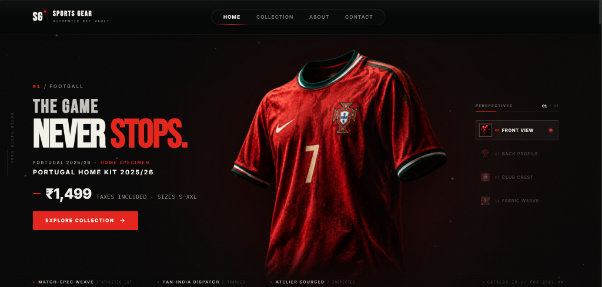
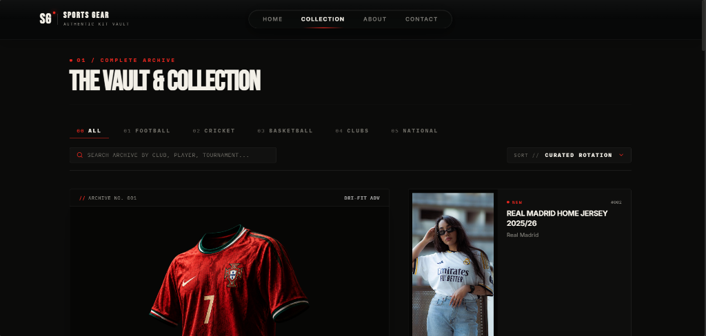
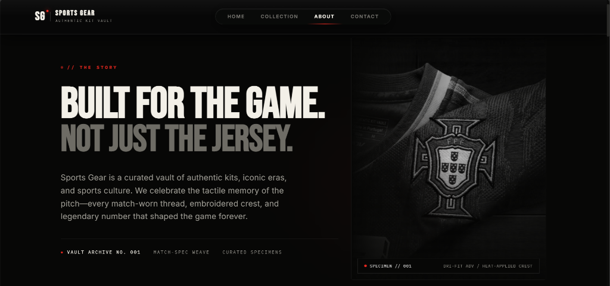
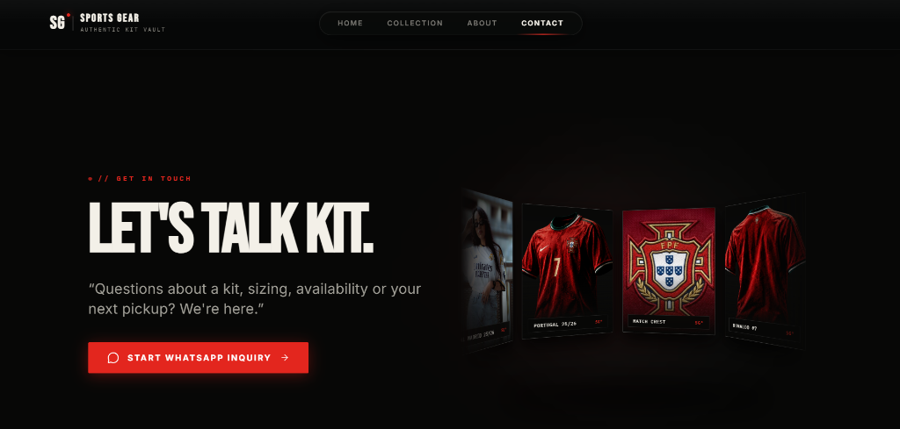

# Sports Gear — Authentic Kit Vault ⚡

<div align="center">



**A luxury digital sportswear catalog and interactive kit discovery experience.**  
*Engineered for premium kit collectors, football enthusiasts, and atelier sourcing.*

[](https://react.dev/)
[](https://www.typescriptlang.org/)
[](https://vitejs.dev/)
[](https://tailwindcss.com/)
[](https://www.framer.com/motion/)
[](https://vercel.com/)

</div>

---

## 📖 Overview

**Sports Gear** is designed from the ground up as a **bespoke digital kit catalog and specimen showcase** rather than a generic e-commerce website. 

Instead of traditional cart and checkout flows, it pairs **high-fidelity editorial presentation** with a **zero-friction WhatsApp Concierge procurement workflow**, allowing collectors to explore tactile match specimens and inquire directly with Mumbai-based kit curators.

---

## ✨ Key Features & Visual Walkthrough

### 1. Interactive Kit Discovery & Macro Telemetry
The centerpiece hero stage showcases iconic match kits with realistic 3D cursor parallax, atmospheric volumetric lighting, floating studio particles, and a **4-angle technical inspection dock**:
- **01 / Front View**: Full silhouette framing with dynamic entrance typography.
- **02 / Back Profile**: Seamless 3D flip rotation displaying official match nameset alignment.
- **03 / Club Crest**: High-density 3.0× macro zoom with gold bullion embroidery specifications.
- **04 / Fabric Weave**: 2.9× zoom revealing engineered Dri-FIT ADV breathability zones and collar trim.

<div align="center">
  
</div>

---

### 2. The Vault & Archival Collection
A curated registry of authentic club and national kits featuring:
- **Instant Multi-Vector Search**: Filter effortlessly across product name, club, player, sport, season, and edition.
- **Disciplines & Classifications**: Categorized across *Football*, *Cricket*, *Basketball*, *Club Heritage*, and *National Teams*.
- **Quick-Flip Specimen Cards**: Instant front/back perspective flip, live stock badges, and verified INR pricing (`₹1,499`).

<div align="center">
  
</div>

---

### 3. Editorial Brand Story & Craftsmanship
An immersive atelier narrative celebrating the culture of the pitch — preserving the tactile heritage of match-worn threads, embroidered shields, and legendary player numbers.

<div align="center">
  
</div>

---

### 4. Direct WhatsApp Concierge & 3D Interactive Carousel
- **Deep-Linked Inquiry Engine**: Eliminates checkout friction. Generates pre-formatted WhatsApp payloads containing item name, catalog ID, selected size (`S`, `M`, `L`, `XL`, `XXL`), and pricing.
- **3D Cylinder Carousel**: Interactive gesture-driven 3D gallery showcasing hero kit rotations and match crest details.
- **Atelier Location Switch**: High-contrast interactive dark-mode map and showroom visiting guide.

<div align="center">
  
</div>

---

## 🛠️ Tech Stack & Architecture

| Layer | Technology |
|---|---|
| **Framework** | [React 19](https://react.dev/) + [Vite 8](https://vitejs.dev/) |
| **Language** | [TypeScript](https://www.typescriptlang.org/) (Strict Mode) |
| **Styling** | [Tailwind CSS v4](https://tailwindcss.com/) with Custom Design Tokens |
| **Motion & 3D** | [Framer Motion](https://www.framer.com/motion/) + Dynamic Spring Physics |
| **Routing** | [React Router v7](https://reactrouter.com/) with Code-Split `React.lazy()` Routes |
| **Icons** | [Lucide React](https://lucide.dev/) |
| **Linter** | [Oxlint](https://oxc.rs/) (Sub-30ms High-Performance Linting) |

---

## 🚀 Getting Started

### 1. Install Dependencies
```bash
npm install
```

### 2. Start Local Development Server
```bash
npm run dev
```
Open [http://localhost:5173](http://localhost:5173) in your browser.

### 3. Build for Production
```bash
npm run build
```

---

## 🌐 Deploy to Vercel

1. Import the repository on [Vercel](https://vercel.com).
2. Set **Root Directory** to `jersey-store`.
3. Set **Framework Preset** to `Vite`.
4. Click **Deploy**.

---

## 📄 License

This project is licensed under the [MIT License](LICENSE).
